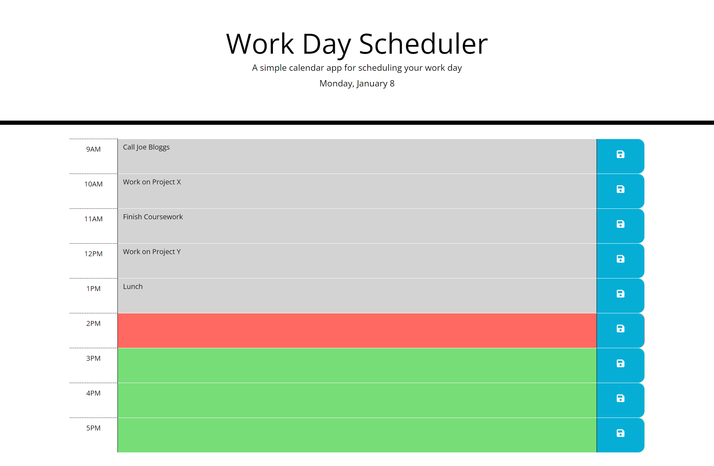

# Work Day Scheduler

## Description

A simple jQuery calendar application that allows a user to save events for each hour of the day.

This application uses the [Day.js](https://day.js.org/) library for date-time manipulation plus [Bootstrap](https://getbootstrap.com/) for layout and [Font Awesome](https://fontawesome.com/) for icons.

The application is deployed to the following URL:

https://willmowlam.github.io/nebulus-work-day-scheduler/

## Features

- Configurable work hours (see assets/js/script.js)
- Save event information in hours by clicking save button
- Event data persists between page refreshes
- Colour-coded slots to indicate past, current and future hours
- Visual feedback when saving event information
- Mobile responsive layout

## Screenshot

